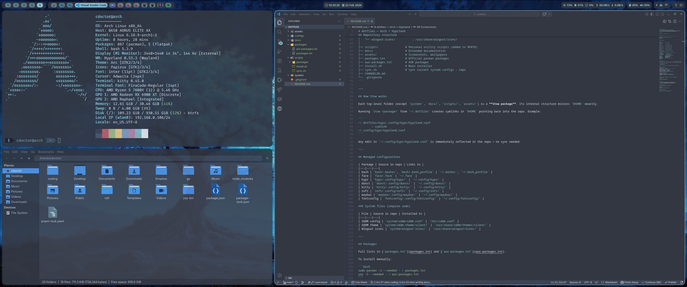

# dotfiles — Arch + Hyprland

Personal configuration for Arch Linux with Hyprland as Wayland compositor based on the Nordic palette.


---

## Screenshots

**Clean**


**Dirty**


**Rofi**


**Wlogout**


**Lock**


---

## Quick install

> ⚠️ Read the full guide before running. The script installs packages and modifies system files.

```bash
git clone https://github.com/cdoctor/dotfiles.git ~/.dotfiles
cd ~/.dotfiles
chmod +x install.sh sync.sh
./install.sh
```

---

## Repository structure

```
dotfiles/
│
├── configs/                        # Stow packages — all symlinked to $HOME
│   ├── bash/                       # → $HOME/.bashrc, $HOME/.bash_profile
│   ├── dunst/                      # → $HOME/.config/dunst/
│   ├── face/                       # → $HOME/.face
│   ├── fontconfig/                 # → $HOME/.config/fontconfig/
│   ├── gtk/                        # → $HOME/.config/gtk-3.0/, gtk-4.0/
│   ├── hypr/                       # → $HOME/.config/hypr/
│   ├── kitty/                      # → $HOME/.config/kitty/
│   ├── rofi/                       # → $HOME/.config/rofi/
│   ├── spicetify/                  # → $HOME/.config/spicetify/
│   ├── waybar/                     # → $HOME/.config/waybar/
│   └── wlogout/                    # → $HOME/.config/wlogout/
│
├── system/                         # Files requiring root — installed via install.sh
│   ├── sddm/
│   │   └── sddm.conf               → /etc/sddm.conf
│   └── sddm-theme/
│       └── silent/                 → /usr/share/sddm/themes/silent/ (modified files only)
│
├── scripts/
│   ├── system-files.conf           # Shared map: repo path ↔ system path
│   ├── install.sh                  # Full installer
│   └── sync.sh                     # Sync system state back into the repo
│
├── packages/
│   ├── packages.txt                # Official pacman packages
│   └── aur-packages.txt            # AUR packages
│
├── docs/
│   ├── keybindings.md
│   ├── setup-guide.md
│   └── theming.md
│
├── assets/
│   ├── screenshots/
│   └── wallpapers/
│
└── .gitignore
```

---

## How Stow works

Each folder inside `configs/` is a **Stow package**. Its internal directory structure mirrors `$HOME` exactly, so Stow knows where to create the symlinks.

```
configs/hypr/.config/hypr/hyprland.conf
              ↕ symlink created by stow
~/.config/hypr/hyprland.conf
```

Any edit to `~/.config/hypr/hyprland.conf` is immediately reflected in the repo — no manual sync needed.

### Adding a new package

When you want to start tracking a new application's config:

```bash
# 1. Create the stow package structure inside configs/
mkdir -p ~/coding/dotfiles/configs/<name>/.config/<name>

# 2. Move the existing config from the system into the repo
mv ~/.config/<name> ~/coding/dotfiles/configs/<name>/.config/

# 3. Create the symlink with stow
stow --dir=/home/user/coding/dotfiles/configs --target=/home/user <name>

# 4. Verify the symlink was created correctly
ls -la ~/.config/<name>
# Expected: ~/.config/<name> -> /home/user/coding/dotfiles/configs/<name>/.config/<name>
```

For files that live directly in `$HOME` (like `.bashrc`):

```bash
mkdir -p ~/coding/dotfiles/configs/<name>
mv ~/.<name>rc ~/coding/dotfiles/configs/<name>/.<name>rc
stow --dir=/home/user/coding/dotfiles/configs --target=/home/user <name>
```

### Removing a package from stow

To remove symlinks without deleting files from the repo:

```bash
stow --dir=/home/user/coding/dotfiles/configs --target=/home/user -D <name>
```

---

## Managed configurations

| Package    | Source in repo                             | Links to                         |
| ---------- | ------------------------------------------ | -------------------------------- |
| bash       | `configs/bash/.bashrc`, `.bash_profile`    | `~/.bashrc`, `~/.bash_profile`   |
| dunst      | `configs/dunst/.config/dunst/`             | `~/.config/dunst/`               |
| face       | `configs/face/.face`                       | `~/.face`                        |
| fontconfig | `configs/fontconfig/.config/fontconfig/`   | `~/.config/fontconfig/`          |
| gtk        | `configs/gtk/.config/gtk-3.0/`, `gtk-4.0/` | `~/.config/gtk-3.0/`, `gtk-4.0/` |
| hypr       | `configs/hypr/.config/hypr/`               | `~/.config/hypr/`                |
| kitty      | `configs/kitty/.config/kitty/`             | `~/.config/kitty/`               |
| rofi       | `configs/rofi/.config/rofi/`               | `~/.config/rofi/`                |
| spicetify  | `configs/spicetify/.config/spicetify/`     | `~/.config/spicetify/`           |
| waybar     | `configs/waybar/.config/waybar/`           | `~/.config/waybar/`              |
| wlogout    | `configs/wlogout/.config/wlogout/`         | `~/.config/wlogout/`             |

### System files (require sudo)

Managed via `scripts/system-files.conf`. Only modified files are tracked — the base SDDM theme is installed via AUR.

| File             | Source in repo                                 | Installed to                             |
| ---------------- | ---------------------------------------------- | ---------------------------------------- |
| SDDM config      | `system/sddm/sddm.conf`                        | `/etc/sddm.conf`                         |
| SDDM custom.conf | `system/sddm-theme/silent/configs/custom.conf` | `/usr/share/sddm/themes/silent/configs/` |
| SDDM metadata    | `system/sddm-theme/silent/metadata.desktop`    | `/usr/share/sddm/themes/silent/`         |

---

## Packages

Full lists in [`packages/packages.txt`](packages/packages.txt) and [`packages/aur-packages.txt`](packages/aur-packages.txt).

To install manually:

```bash
sudo pacman -S --needed - < packages/packages.txt
yay -S --needed - < packages/aur-packages.txt
```

---

## Documentation

- [`docs/keybindings.md`](docs/keybindings.md) — all Hyprland keybindings
- [`docs/setup-guide.md`](docs/setup-guide.md) — step-by-step post Arch install guide
- [`docs/theming.md`](docs/theming.md) — colors, fonts, GTK theme choices

---

## Workflow

### Editing configs

Since configs are symlinked, just edit normally and commit:

```bash
# Edit any config file as usual, then:
cd ~/coding/dotfiles
git add -A
git commit -m "feat(hypr): adjust border radius"
git push
```

### Syncing packages and system files

```bash
./sync.sh                  # update package lists + copy system files into repo
./sync.sh --packages-only  # only update package lists
./sync.sh --system-only    # only copy system files into repo

git add -A && git commit -m "chore: sync"
```
