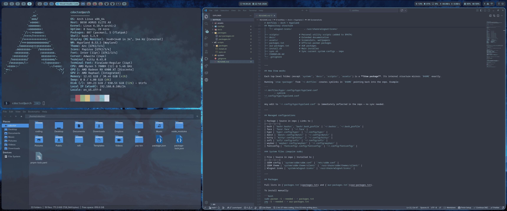
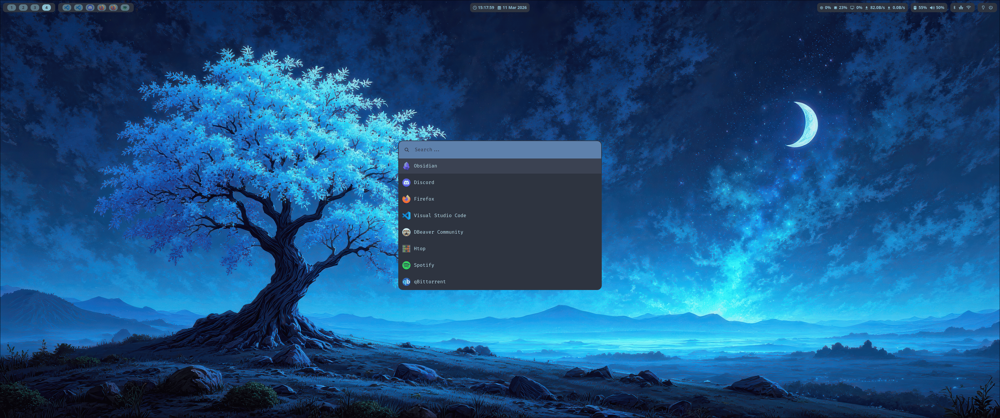

# dotfiles — Arch + Hyprland

Personal configuration for Arch Linux with Hyprland as Wayland compositor based on the Nordic palette.


---

## Overview

This repository contains all the configuration files for a fully customized Arch Linux desktop. The setup is built around consistency — every application from the terminal to the notification daemon follows the same Nordic palette and design language.

**System:**

| Component    | Choice              |
| ------------ | ------------------- |
| OS           | Arch Linux          |
| Compositor   | Hyprland (Wayland)  |
| Shell        | Bash                |
| Terminal     | Kitty               |
| Color scheme | Nordic (Nord-based) |

**Key applications:**

| Role              | Application                 |
| ----------------- | --------------------------- |
| App launcher      | rofi-wayland                |
| Power menu        | rofi-wayland                |
| Status bar        | Waybar                      |
| Notifications     | Dunst                       |
| Clipboard manager | Clipse                      |
| Wallpaper         | Hyprpaper                   |
| Lock screen       | Hyprlock                    |
| Display manager   | SDDM with silent theme      |
| File manager      | Thunar                      |
| Text editor       | VSCode (synced via account) |
| Browser           | Firefox                     |

---

## Versions

Key component versions this configuration is tested against. Hyprland configurations use the **declarative `.conf` syntax** — Lua config is not in use.

| Component | Version |
| --------- | ------- |
| Kernel    | 7.1.3   |
| Hyprland  | 0.55.4  |
| Hyprlock  | 0.9.5   |
| Waybar    | 0.15.0  |
| Kitty     | 0.47.4  |
| Rofi      | 2.0.0   |
| Dunst     | 1.13.2  |

> Hyprland is under active development and introduces breaking changes between minor versions. If something doesn't work after updating, check the [Hyprland changelog](https://github.com/hyprwm/Hyprland/releases) for deprecated or renamed options.

---

## Screenshots

**Clean**


**Dirty**


**Rofi**


**Power Menu**


**Lock**


---

## Documentation

- [`docs/applications.md`](docs/applications.md) — complete list of applications by category
- [`docs/keybindings.md`](docs/keybindings.md) — all Hyprland & Kitty keybindings
- [`docs/managing.md`](docs/managing.md) — how to add, remove and maintain configurations
- [`docs/scripts.md`](docs/scripts.md) — reference for `install.sh`, `sync.sh` and `status.sh`
- [`docs/setup-guide.md`](docs/setup-guide.md) — step-by-step post Arch install guide
- [`docs/theming.md`](docs/theming.md) — colors, fonts, GTK theme choices

---

## Quick install

> ⚠️ Read the full guide before running. The script installs packages and modifies system files.

```bash
# 1. Install prerequisites
sudo pacman -S --needed git stow

# 2. Clone the repository to the standard path
git clone https://github.com/CDoctor00/dotfiles.git ~/.dotfiles
cd ~/.dotfiles

# 3. Make scripts executable
chmod +x scripts/install.sh scripts/sync.sh

# 4. Run the installer
./scripts/install.sh
```

---

## Repository structure

```
dotfiles/
│
├── assets/
│   ├── screenshots/
│   └── wallpapers/
│
├── configs/                        # Stow packages — all symlinked to $HOME
│   ├── bash/                       # → $HOME/.bashrc, $HOME/.bash_profile
│   ├── clipse/                     # → $HOME/.config/clipse/
│   ├── dunst/                      # → $HOME/.config/dunst/
│   ├── face/                       # → $HOME/.face
│   ├── fontconfig/                 # → $HOME/.config/fontconfig/
│   ├── fonts/                      # → $HOME/.local/share/fonts/
│   ├── gtk/                        # → $HOME/.config/gtk-3.0/, gtk-4.0/
│   ├── hypr/                       # → $HOME/.config/hypr/
│   ├── kitty/                      # → $HOME/.config/kitty/
│   ├── rofi/                       # → $HOME/.config/rofi/
│   ├── spicetify/                  # → $HOME/.config/spicetify/
│   └── waybar/                     # → $HOME/.config/waybar/
│
├── docs/
│   ├── applications.md
│   ├── keybindings.md
│   ├── managing.md
│   ├── scripts.md
│   ├── setup-guide.md
│   └── theming.md
│
├── logs/                           # Runtime logs — not tracked by git
│
├── packages/
│   ├── packages.txt                # Official pacman packages
│   └── aur-packages.txt            # AUR packages
│
├── scripts/
│   ├── system-files.conf           # Shared map: repo path ↔ system path
│   ├── install.sh                  # Full installer
│   ├── sync.sh                     # Sync system state back into the repo
│   └── status.sh                   # Health-check for the whole setup
│
├── system/                         # Files requiring root — installed via install.sh
│   ├── pacman/
│   │   └── pacman.conf             → /etc/pacman.conf
│   ├── sddm/
│   │   └── sddm.conf               → /etc/sddm.conf
│   └── sddm-theme/
│       └── silent/                 → /usr/share/sddm/themes/silent/ (modified files only)
│
└── .gitignore
```

---

## Managed configurations

Configurations are managed in two different ways depending on where they live on the system. User-space configs (under `$HOME`) are handled with **GNU Stow**, which creates symlinks so that any edit is immediately reflected in the repo. System-level files (under `/etc` or `/usr/share`) require root access and cannot be symlinked, so they are managed via **install/sync scripts** that copy files in both directions.

### Inventory

#### Stow packages

| Package    | Source in repo                             | Links to                                      |
| ---------- | ------------------------------------------ | --------------------------------------------- |
| bash       | `configs/bash/.bashrc`, `.bash_profile`    | `~/.bashrc`, `/root/.bashrc`, `.bash_profile` |
| clipse     | `configs/clipse/.config/clipse/`           | `~/.config/clipse/`                           |
| dunst      | `configs/dunst/.config/dunst/`             | `~/.config/dunst/`                            |
| face       | `configs/face/.face`                       | `~/.face`                                     |
| fontconfig | `configs/fontconfig/.config/fontconfig/`   | `~/.config/fontconfig/`                       |
| fonts      | `configs/fonts/.local/share/fonts/`        | `~/.local/share/fonts/`                       |
| gtk        | `configs/gtk/.config/gtk-3.0/`, `gtk-4.0/` | `~/.config/gtk-3.0/`, `gtk-4.0/`              |
| hypr       | `configs/hypr/.config/hypr/`               | `~/.config/hypr/`                             |
| kitty      | `configs/kitty/.config/kitty/`             | `~/.config/kitty/`                            |
| rofi       | `configs/rofi/.config/rofi/`               | `~/.config/rofi/`                             |
| spicetify  | `configs/spicetify/.config/spicetify/`     | `~/.config/spicetify/`                        |
| waybar     | `configs/waybar/.config/waybar/`           | `~/.config/waybar/`                           |

> **Note on bash**: The root user's bashrc is copied to `/root/.bashrc` via `install.sh` since it cannot use symlinks. When updating the configuration, run `./install.sh --symlinks-only --root-bashrc-only` to sync changes to both the user and root bashrc files.

#### System files

Managed via `scripts/system-files.conf`. Only modified files are tracked — the base SDDM theme is installed via AUR.

| File             | Source in repo                                 | Installed to                             |
| ---------------- | ---------------------------------------------- | ---------------------------------------- |
| Pacman config    | `system/pacman/pacman.conf`                    | `/etc/pacman.conf`                       |
| SDDM config      | `system/sddm/sddm.conf`                        | `/etc/sddm.conf`                         |
| SDDM custom.conf | `system/sddm-theme/silent/configs/custom.conf` | `/usr/share/sddm/themes/silent/configs/` |
| SDDM metadata    | `system/sddm-theme/silent/metadata.desktop`    | `/usr/share/sddm/themes/silent/`         |

For detailed instructions on adding or removing configurations, see [`docs/managing.md`](docs/managing.md).

---

## Packages

Full lists in [`packages/packages.txt`](packages/packages.txt) and [`packages/aur-packages.txt`](packages/aur-packages.txt).

To install manually:

```bash
sudo pacman -S --needed - < packages/packages.txt
yay -S --needed - < packages/aur-packages.txt
```

---

## Workflow

### Editing configs

Since configs are symlinked, just edit normally and commit:

```bash
# Edit any config file as usual, then:
cd ~/.dotfiles
git add -A
git commit -m "feat(hypr): adjust border radius"
git push
```

### Syncing packages and system files

```bash
./scripts/sync.sh                  # update package lists + copy system files into repo + refresh README versions
./scripts/sync.sh --packages-only  # only update package lists
./scripts/sync.sh --system-only    # only copy system files into repo
./scripts/sync.sh --versions-only  # only refresh the version table in this README

git add -A && git commit -m "chore: sync"
```

> After syncing, a log file is saved to `logs/sync_<timestamp>.log`. Check it if any step reported warnings or errors.

### Checking system health

```bash
./scripts/status.sh
```

Read-only diagnostic — checks Stow symlinks, system file alignment, critical binaries, and stale paths from past migrations. See [`docs/scripts.md`](docs/scripts.md) for details on all three scripts.
